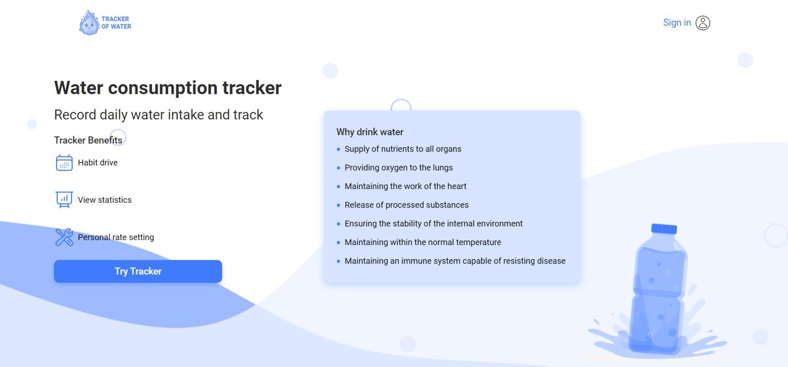
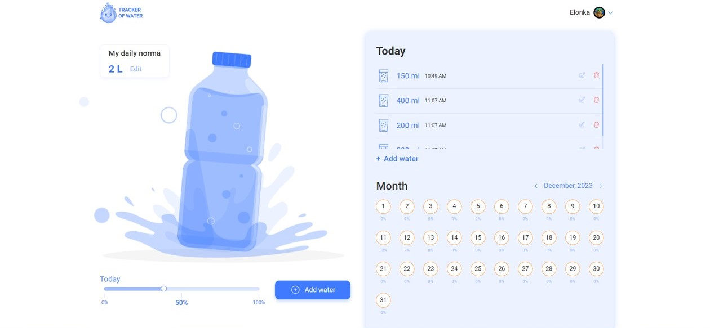
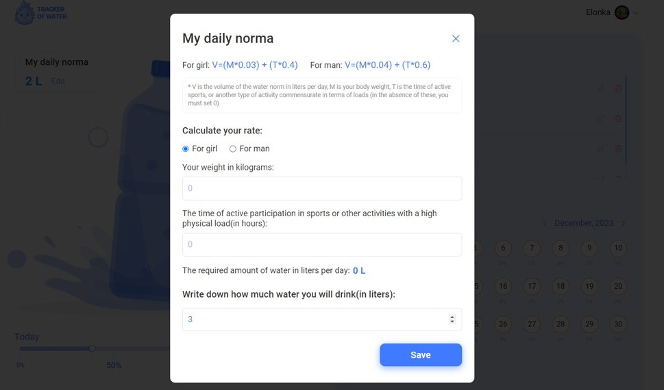
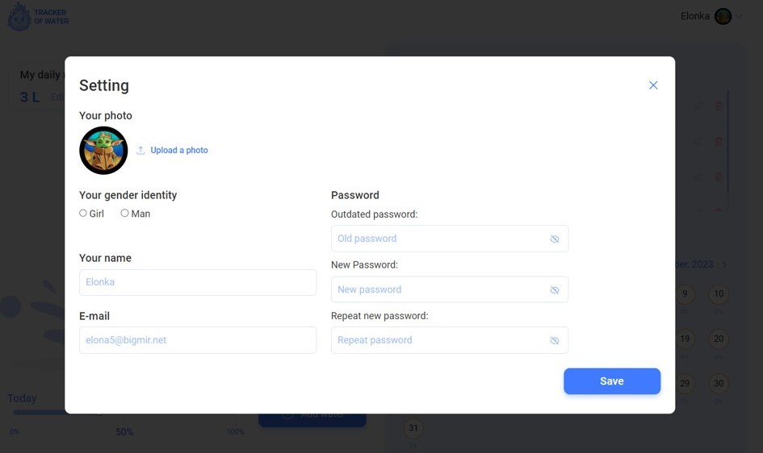

# Water Tracker

This project was bootstrapped with [Create React App](https://github.com/facebook/create-react-app).

# Water Tracker API

This is backend API for [Water Tracker App](https://github.com/SakhnoDima/waterTrackerApi).The API handles data storage, retrieval, and management for the Water Tracker application.

## To get more details you can visit [Doc File](https://water-tracker-f07j.onrender.com/api/docs)

# Overview

The Water Tracker App is a user-friendly application designed to help individuals monitor and record their daily water intake. Staying hydrated is essential for maintaining good health, and this app provides a convenient way for users to track and visualize their hydration habits.

# Features:

## Record Water Intake

Log Water Consumption: Easily record the amount of water you drink throughout the day.
Track Time: Record the time when you consume water to establish a consistent hydration routine.

## Calendar

Historical Overview: View a calendar to see your water consumption history.
Analyze Patterns: Identify trends in your hydration habits over time.

## Daily Norma

Set Daily Water Goals: Define your daily water intake goals based on personalized recommendations or your preferences.
Visual Progress: Track your daily water consumption progress with a graphical representation of your goals.

## Add Water

Quick Entry: Use a simple form to add water intake with just a few clicks.
Customization: Choose the specific amount of water and the time you consumed it.

## User Settings

Explore various settings to customize your Water Tracker experience. Here are some features you can manage:

**Change Avatar:**
Update your profile picture by navigating to the "Settings" section. Choose an avatar that represents you.

**Update Name:**
Easily modify your displayed name within the app. Personalize it to make the Water Tracker experience uniquely yours.

## Available Scripts

In the project directory, you can run:

### `npm start`

Runs the app in the development mode.\
Open [http://localhost:3000](http://localhost:3000) to view it in your browser.

The page will reload when you make changes.\
You may also see any lint errors in the console.

### `npm test`

Launches the test runner in the interactive watch mode.\
See the section about [running tests](https://facebook.github.io/create-react-app/docs/running-tests) for more information.

### `npm run build`

Builds the app for production to the `build` folder.\
It correctly bundles React in production mode and optimizes the build for the best performance.

The build is minified and the filenames include the hashes.\
Your app is ready to be deployed!

See the section about [deployment](https://facebook.github.io/create-react-app/docs/deployment) for more information.

### `npm run eject`

**Note: this is a one-way operation. Once you `eject`, you can't go back!**

If you aren't satisfied with the build tool and configuration choices, you can `eject` at any time. This command will remove the single build dependency from your project.

Instead, it will copy all the configuration files and the transitive dependencies (webpack, Babel, ESLint, etc) right into your project so you have full control over them. All of the commands except `eject` will still work, but they will point to the copied scripts so you can tweak them. At this point you're on your own.

You don't have to ever use `eject`. The curated feature set is suitable for small and middle deployments, and you shouldn't feel obligated to use this feature. However we understand that this tool wouldn't be useful if you couldn't customize it when you are ready for it.

## Learn More

You can learn more in the [Create React App documentation](https://facebook.github.io/create-react-app/docs/getting-started).

To learn React, check out the [React documentation](https://reactjs.org/).

### Code Splitting

This section has moved here: [https://facebook.github.io/create-react-app/docs/code-splitting](https://facebook.github.io/create-react-app/docs/code-splitting)

### Analyzing the Bundle Size

This section has moved here: [https://facebook.github.io/create-react-app/docs/analyzing-the-bundle-size](https://facebook.github.io/create-react-app/docs/analyzing-the-bundle-size)

### Making a Progressive Web App

This section has moved here: [https://facebook.github.io/create-react-app/docs/making-a-progressive-web-app](https://facebook.github.io/create-react-app/docs/making-a-progressive-web-app)

### Advanced Configuration

This section has moved here: [https://facebook.github.io/create-react-app/docs/advanced-configuration](https://facebook.github.io/create-react-app/docs/advanced-configuration)

### Deployment

This section has moved here: [https://facebook.github.io/create-react-app/docs/deployment](https://facebook.github.io/create-react-app/docs/deployment)

### `npm run build` fails to minify

This section has moved here: [https://facebook.github.io/create-react-app/docs/troubleshooting#npm-run-build-fails-to-minify](https://facebook.github.io/create-react-app/docs/troubleshooting#npm-run-build-fails-to-minify)
